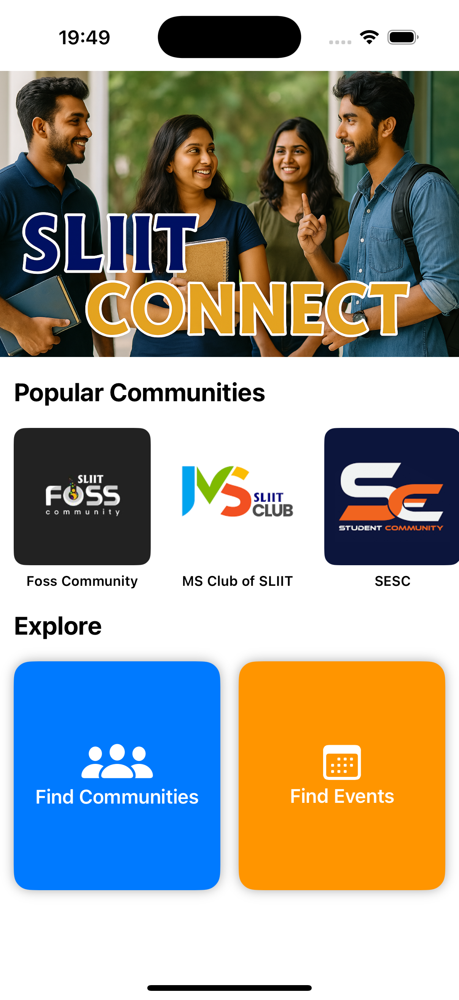
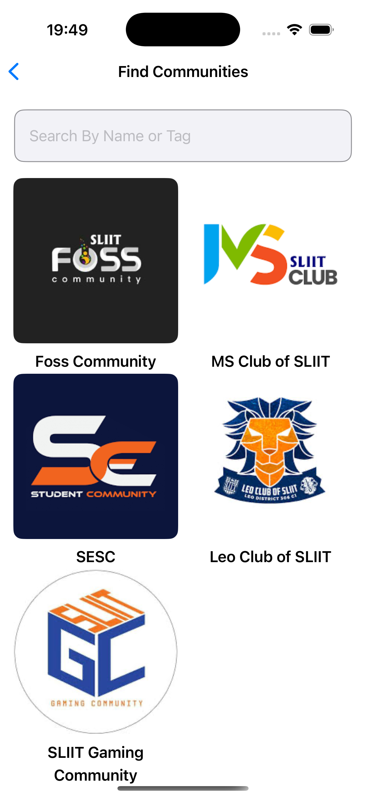
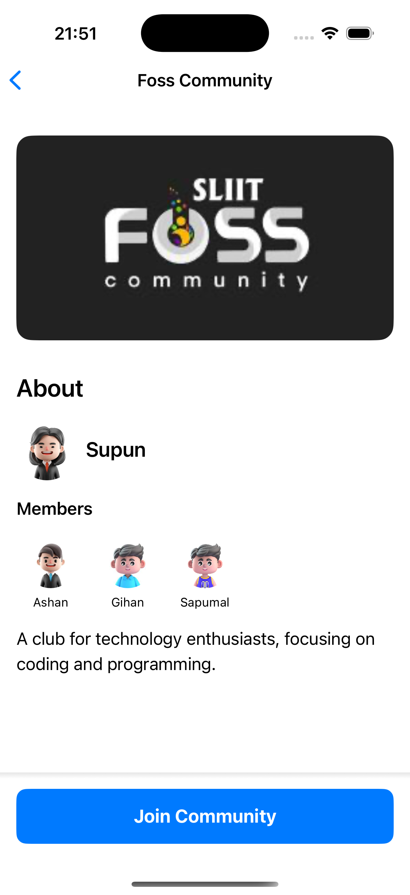
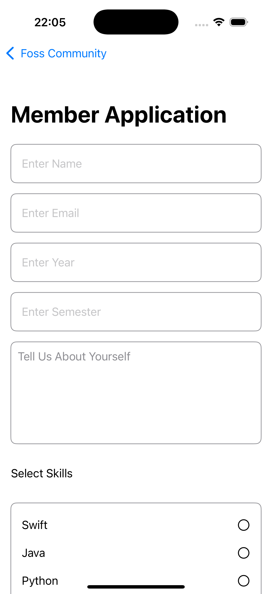
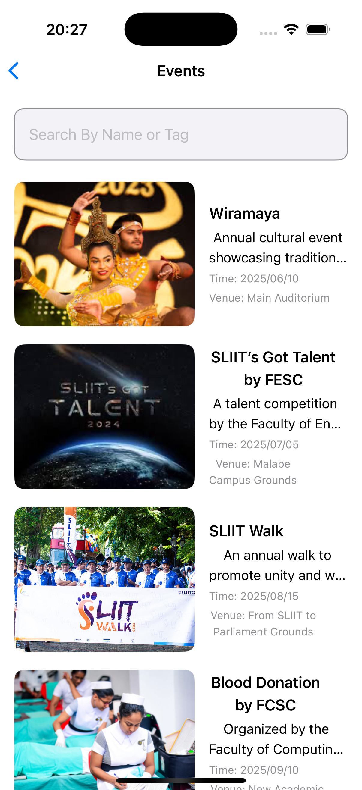
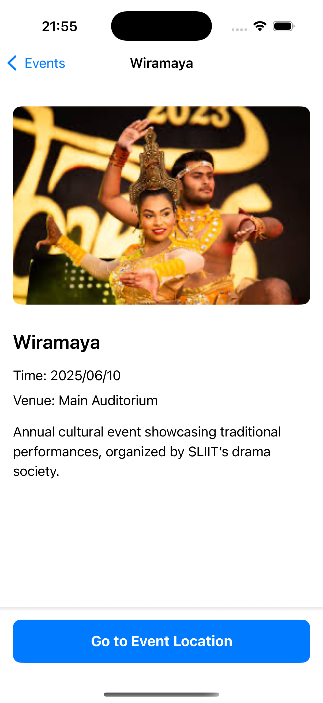

Please go under edit and edit this file as needed for your project.  There is no seperate documentation needed.

# Project Name - SLIIT CONNECT
# Student Id - IT21165252
# Student Name - Kuruppu K.A.G.S.R

#### 01. Brief Description of Project - 
SLIIT Connect is a mobile application specifically developed for students of SLIIT (Sri Lanka Institute of Information Technology) to simplify joining and engaging with various student clubs and communities. It centralizes information about student-run clubs, provides advanced search capabilities to match students' interests, simplifies the registration and joining processes, and displays upcoming events, allowing students to register and participate seamlessly.

#### 02. Users of the System - 

SLIIT Students: Both undergraduate and postgraduate students seeking easy access to extracurricular activities and student communities.

Club and Community Administrators: Responsible for recruiting members, communicating with club members, and managing event promotions.

#### 03. What is unique about your solution -

SLIIT Connect uniquely addresses the fragmented and inefficient current system, consolidating multiple disconnected social media channels into one streamlined, user-friendly platform. It provides advanced search functionality tailored specifically to students' personal interests, a unified registration system, and centralized event management, significantly improving student engagement and club visibility.

#### 04. Briefly document the functionality of the screens you have (Include screen shots of images)

-----
Screen 1: Home Screen This screen lists featured clubs, upcoming events, and popular clubs. Students can quickly navigate to club details or event pages directly from here.




Screen 2: Clubs Directory ScreenProvides a comprehensive, searchable list of all available clubs at SLIIT. Students can filter clubs by categories such as technology, sports, arts, or academic interests, simplifying discovery.




Screen 3: Club Detail ScreenDisplays detailed information about a selected club, including club descriptions, membership criteria, activities, and upcoming events. Users can join the club directly from this page.




Screen 4: Club Registration Page.




Screen 5: Event Calendar ScreenShowcases upcoming events from all clubs in a centralized, easy-to-navigate calendar format. Students can directly view event details and register their participation within the app.




Screen 6: Registration/Membership ScreenStreamlines the membership registration process, allowing students to join clubs with a single unified form within the app, eliminating the repetitive filling of external forms.



-----

#### 05. Give examples of best practices used when writing code
e.g The code below uses consistant naming conventions for variables, uses structures and constants where ever possible. (Elaborate a bit more on what you did)


---

#### 1. **Consistent Naming Conventions**

```swift
@State private var searchText = ""
let sampleEvents: [Event] = [ ... ]
```

Uses `camelCase` consistently for variables, methods, and properties (`searchText`, `photoURL`, `filterCommunities`). This aligns with Swift’s standard naming conventions and improves readability.

---

#### 2. **Use of `struct` for Models**

```swift
struct Event: Identifiable { ... }
struct Community: Identifiable { ... }
struct CommunityMember: Identifiable { ... }
```

Using `struct`s instead of `class` promotes immutability and better performance. Conforming to `Identifiable` helps with rendering items in SwiftUI `List` or `ForEach`.

---

#### 3. **Separation of Concerns**

- `FindCommunitiesView.swift` – Handles searching and displaying communities.
- `ViewCommunityView.swift` – Displays detailed info about a community.
- `RegisterToCommunityView.swift` – Community registration form.

Each view is responsible for a single function, following the **Single Responsibility Principle** for maintainability and modularity.

---

#### 4. **Reusable UI Components**

```swift
CustomTextField(...)
CustomButton(...)
MultiSelectPicker(...)
```

Encapsulates common UI elements into custom reusable views, promoting code reuse, reducing duplication, and ensuring consistency across screens.

---

#### 5. **Graceful Image Loading with AsyncImage**

```swift
AsyncImage(url: URL(string: community.photoURL)) { image in
    image.resizable()
} placeholder: {
    ProgressView()
}
```

Handles image loading asynchronously with a fallback `ProgressView` for better UX during slow network conditions.

---

#### 6. **Encapsulation with `private` Access**

```swift
private func filterCommunities(searchText: String) -> [Community] { ... }
private let items = [...]
```

Keeps helper methods and constants scoped to the view, improving code safety and limiting exposure to unnecessary parts of the codebase.

---

#### 7. **Dynamic Grid Layouts**

```swift
LazyVGrid(columns: items, spacing: 2) { ... }
```

Makes use of `LazyVGrid` for dynamic and responsive layouts across various screen sizes, enhancing scalability of UI.

---

#### 8. **Modern Navigation with `NavigationStack`**

```swift
NavigationStack {
    ScrollView { ... }
}
```

Uses `NavigationStack` (introduced in iOS 16) instead of the deprecated `NavigationView`, providing better navigation state handling.

---

#### 9. **Use of Constants for External URLs**

```swift
private let getFormWebhookURL = "https://getform.io/f/..."
```

Defines constants for webhooks and external strings to prevent duplication and make future changes easier.

---

#### 10. **Real-Time Filtering with Functional Swift**

```swift
sampleEvents.filter { event in
    event.title.lowercased().contains(searchText.lowercased())
}
```

Implements filtering using Swift’s functional methods like `filter` and `contains`, creating efficient and clean logic for real-time search functionality.

---


#### 06. UI Components used


The following SwiftUI components were used throughout the SLIIT Connect application to build an intuitive and dynamic user interface:

---

#### **Navigation & Layout**
- `NavigationStack`
- `NavigationLink`
- `ScrollView`
- `LazyVGrid`
- `VStack`, `HStack`, `ZStack`
- `Group`

---

#### **Input & Forms**
- `TextField`
- `TextEditor`
- `@State` bindings for form data
- `MultiSelectPicker` (custom component for checkbox-like selection)
- `Button` / `CustomButton` (reusable styled button)

---

#### **Text & Image**
- `Text`
- `Image`
- `AsyncImage` (for loading remote images)
- `ProgressView` (as placeholder)

---

#### **Styling & Shapes**
- `RoundedRectangle`
- `cornerRadius`, `padding`, `frame`, `background`, `foregroundStyle`, etc.

---

#### **Map & Location**
- `MapKit` (via `MKMapItem`, `CLLocationCoordinate2D`, and `MKPlacemark` to open map location)

---

#### **Custom Components**
- `CustomTextField`
- `CustomButton`
- `MultiSelectPicker`
- `CustomExploreButton` (used in HomeView for navigation tiles)

---

These components come together to form a smooth user experience for navigating, filtering, joining communities, and viewing events in the app.

#### 07. Testing carried out

cmd + u to run tests
#### ✅ Unit Testing (sliitconnectTests)

The following test cases were implemented to verify the **model logic and data integrity** of the sliitconnect app:

#### 📄 `EventDataTests.swift`
- Tested that the `sampleEvents` array is not empty.
- Verified that all events have non-empty titles and venues.
- Checked that event coordinates (latitude and longitude) are valid and not zero.
- Confirmed that specific keywords (e.g., "Culture") are found in tags for relevant events.

#### 📄 `CommunityDataTests.swift`
- Ensured the `popularCommunities` array is loaded with data.
- Verified that each community has a valid leader with a name.
- Tested that `totalMembers` correctly reflects members plus the leader.
- Confirmed that each community has at least one skill.

#### 📄 `RegisterToCommunityFormTests.swift`
- Simple validation logic to verify correct behavior for selected skills.
- Tested inclusion and exclusion of expected strings in the skills array.


#### 🎯 UI Testing (sliitconnectUITests)

The following UI tests were created to simulate **real user interactions and navigation**:

#### 📄 `HomeViewUITests.swift`
- Verified that tapping on "Find Communities" navigates to the correct view.
- Verified that tapping on "Find Events" opens the event list view.

#### 📄 `NavigationFlowTests.swift`
- Navigated from the home screen to a community detail page, and then to the registration form via the "Join Community" button.
- Navigated to an event detail view and verified the "Go to Event Location" button exists.


#### 08. Documentation 

## (a) Design Choices

1. **Modular Directory Structure**
   - Organized the code into folders like `Communities`, `Events`, and `Components`, which promotes separation of concerns.
   - Assets and data models are cleanly separated, aiding in scalability and collaboration.

2. **Reusable UI Components**
   - `CustomButton` and `CustomTextField` were reusable views, reducing duplication and improving maintainability.

3. **Responsive Design**
   - Used dynamic sizing (`UIScreen.main.bounds`) to ensure the layout adapted across different screen sizes.

4. **Search Functionality**
   - Implemented real-time filtering based on user input using `.filter` and `@State`, enhancing UX.

5. **Visual Hierarchy**
   - Leveraged clear headings, image thumbnails, and text styling to maintain user-friendly navigation and readability.

---

## (b) Implementation Decisions

1. **Model Definitions with Swift Structs**
   - Defined `Community`, `CommunityMember`, and `Event` as `Identifiable` structs for use in `ForEach` and dynamic views.

2. **Navigation Management with NavigationStack**
   - Replaced `NavigationView` with `NavigationStack` for better state management and stack-like navigation.

3. **Form Submission with GetForm.io**
   - Used GetForm webhook for form data submission in `RegisterToCommunityView` — simplified backend handling.

4. **Multi-Select Skill Picker**
   - Created a custom component `MultiSelectPicker` with built-in logic to toggle skills, improving form usability.

5. **MapKit Integration**
   - Used `MKMapItem` to launch Apple Maps with event coordinates, making use of native iOS capabilities.

6. **AsyncImage for Network Images**
   - `AsyncImage` allowed non-blocking image loading with a placeholder, enhancing performance and visual feedback.

---

## (c) Challenges Faced During Development

1. **Dynamic Layout Issues**
   - Managing responsive grids and dynamic content sizing across different device sizes had been tricky with `LazyVGrid`.

2. **State Management**
   - Keeping track of state in forms (`@State`) and updating views conditionally could have led to bugs if not managed well.

3. **Navigation Flow**
   - Coordinating navigation between multiple nested views while maintaining data consistency had become complex.

4. **Form Validation**
   - Ensuring the form was valid before submission and dealing with user input errors had required extra attention.

5. **Data Binding for Skills**
   - Binding an array (`selectedSkills`) and ensuring UI updated properly for each skill selection had been challenging.

6. **Handling Network Requests**
   - Sending JSON via `URLSession` and dealing with error handling or server issues without a UI error feedback system had been a hurdle.

7. **Image Asset Handling**
   - Proper organization and resolution support for image assets in `Assets.xcassets` had needed careful management.

8. **Preview Rendering in SwiftUI**
   - Ensuring that previews (`#Preview`, `PreviewProvider`) worked without real-time data or network had required mock data setup.

---

This breakdown highlights a strong understanding of SwiftUI's capabilities and best practices in structuring a student-focused app like this.

#### 09. Reflection


#### Challenges Faced

Apart from the common technical limitation of requiring access to a Mac machine, I encountered a few personal and workflow-related challenges during this assignment:

1. **Time Management**
   - Balancing this assignment alongside other academic and personal responsibilities was challenging. SwiftUI projects can be time-consuming, especially when debugging layout or navigation issues.

2. **Learning Curve with SwiftUI**
   - Although I had prior experience with Swift, fully adapting to SwiftUI’s declarative style required some adjustment. Understanding how views update based on state and how to compose custom components took time.

3. **Planning the Architecture**
   - Early in the assignment, I hadn’t completely planned out how components should interact. This led to some rework when I realized better ways to structure the codebase.

4. **UI/UX Considerations**
   - Designing intuitive and user-friendly layouts without a UI/UX background posed difficulties. I relied on trial and error and feedback to iterate on the layout.

5. **Form Design & Data Handling**
   - Designing a usable and clean registration form and figuring out how to submit it to an external service (GetForm) while maintaining user data structure was a bit complex.

### How I Would Have Approached This Differently

1. **Started with Wireframes**
   - I would begin with sketches or mockups of each screen before jumping into code. This would have saved time spent reorganizing views later.

2. **Followed a Component-First Approach**
   - Designing and testing reusable components like buttons and text fields earlier in the process would have accelerated UI development and consistency.

3. **Focused More on State Management from the Start**
   - I would have planned out all `@State`, `@Binding`, and other data flows early to avoid inconsistencies or bugs.

4. **Incorporated More User Feedback**
   - I would have asked peers to test the prototype and provide UI/UX feedback sooner to make usability improvements.

5. **Used Mock Data More Strategically**
   - Setting up mock APIs or dynamic JSON loading could have made the data layer more scalable and realistic for a production-style app.

6. **Prioritized Features**
   - Instead of trying to include everything at once, I would have focused on one core flow (like community discovery and joining) before adding events or extra polish.

---

Overall, the experience was rewarding. It taught me the value of clean architecture, reusability, and user-focused design when building apps using SwiftUI.


  

